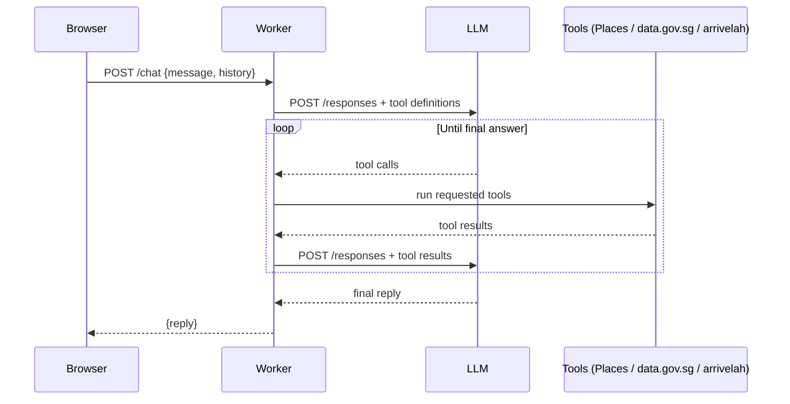

# Lunch Uncle

Lunch Uncle is a chatbot that tells you where to eat lunch near CT Hub 2, Lavender, Singapore. Uncle speaks casual Singaporean English, and he has strong opinions about where you should go.

## Architecture

Lunch Uncle runs as a single Cloudflare Worker. `src/index.js` routes requests: `GET /` serves the chat page from `src/ui.html`, and `POST /chat` hands the turn to the agentic loop in `src/loop.js`. The loop calls the OpenCode Go Responses API (`/responses`) with the `gpt-6-luna` model, passing the tool definitions from `src/tools.js`. When the model asks for a tool call, the loop runs it, appends the result to the input items, and calls the model again. This repeats until the model gives a final answer with no more tool calls, or until 8 rounds have passed. If `GOOGLE_PLACES_API_KEY` is missing, food questions get a fixed reply instead of a search; rain and bus questions still work. `src/prompt.js` builds the system prompt that sets Uncle's persona and rules. There are three tools: `find_lunch_places`, which queries the Google Places API (New) Text Search, biased towards CT Hub 2; `get_rain_forecast`, which reads the two-hour forecast from data.gov.sg (no key needed); and `get_bus_arrivals`, which reads live arrivals from arrivelah (no key needed).

## Request flow



## Setup

1. Clone this repository.
2. Install dependencies:
   ```sh
   npm install
   ```
3. Create `.env` from `.env.example`, then put your keys in `.env`:
   ```sh
   cp .env.example .env
   ```
   ```
   OPENCODE_API_KEY=your-key-here
   GOOGLE_PLACES_API_KEY=your-key-here
   ```
   Put real keys only in `.env`, which is gitignored. `.env.example` is committed, so leave it with empty values. `wrangler dev` reads `.env` and never `.env.example`.

   On Windows, create `.env` by copying the file (`cp` works in PowerShell too) or with your editor. Avoid `echo ... > .env` in Windows PowerShell 5.1: it writes UTF-16, which Wrangler cannot read, so the Worker starts with no keys.
4. `LLM_BASE_URL` and `LLM_MODEL` at the top of `src/loop.js` point at OpenCode Go (`https://opencode.ai/zen/go/v1`) and `gpt-6-luna`. GPT Luna models are only served on the Responses API, so `callModel` posts to `/responses` rather than `/chat/completions`. The Go endpoint requires an `x-opencode-session` header, which `callModel` already sends.

   To change model, pick one from `GET https://opencode.ai/zen/go/v1/models` that is served on `/responses` (see https://opencode.ai/docs/go/). Most other Go models, such as `glm-5.3`, only support chat completions and would need the loop changed back. Not every key can use every model.
5. Start the dev server:
   ```sh
   npm run dev
   ```
   Open http://localhost:8787 and chat with Uncle. On startup Wrangler should print `Using secrets defined in .env` followed by `env.OPENCODE_API_KEY` and `env.GOOGLE_PLACES_API_KEY`. If the key names are missing, the keys were not loaded; see [Troubleshooting](#troubleshooting).
6. To deploy, set the secrets on Cloudflare first, then deploy:
   ```sh
   wrangler secret put OPENCODE_API_KEY
   wrangler secret put GOOGLE_PLACES_API_KEY
   npm run deploy
   ```

Secrets never go in code or in `wrangler.toml`. Local development reads them from `.env`, which is gitignored; production reads them from Cloudflare secrets set with `wrangler secret put`.

## Troubleshooting

| Symptom | Cause | Fix |
| --- | --- | --- |
| `LLM returned 401 ... Invalid API key` | Wrangler loaded no OpenCode key: `.env` is missing, empty, or saved as UTF-16; or the key was revoked. | Recreate `.env` by copying `.env.example` and filling it in, then restart `npm run dev` and check that both key names are listed under `Using secrets defined in .env` (a UTF-16 file prints that line but loads nothing). If it still fails, get a new key. |
| `LLM returned 403 ... Model access is disabled` | Your key cannot use `LLM_MODEL`. | Use a model your key can access, or ask whoever issued the key. |
| `LLM returned 400 ... ModelProtocolUnsupported` | The model is not served on the endpoint the loop calls. | Pick a model served on `/responses`, or change `callModel` to match the model's endpoint. |
| Uncle always says "Just go Berseh Food Centre lah." | `GOOGLE_PLACES_API_KEY` is not loaded, so food questions get the fallback. | Same as the 401 fix: check that `.env` is loaded. |
| Requests time out after 60 seconds | The model took longer than `LLM_TIMEOUT_MS`. | Retry, or raise `LLM_TIMEOUT_MS` in `src/loop.js`. |

## Running tests

```sh
npm test
```

This runs Node's built-in test runner. There are no test dependencies to install.

## Course key setup

For facilitators setting up a shared Google Places key for a course run:

1. In Google Cloud Console, create a new project for the course.
2. Enable **Places API (New)** only. Do not enable the legacy Places API.
3. Create an API key under APIs & Services → Credentials.
4. Under key restrictions, choose "Restrict key" and tick only Places API (New).
5. Go to APIs & Services → Places API (New) → Quotas, and cap requests per day to a modest number, such as 1,000.
6. In Billing → Budgets & alerts, create a budget with email alerts at 50% and 100%.

Treat the LLM key the same way: one key per course run, revoked once the course ends.

## Licence

MIT.
